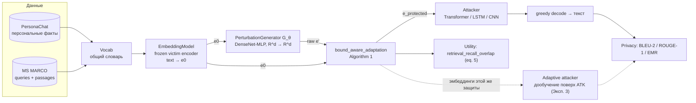
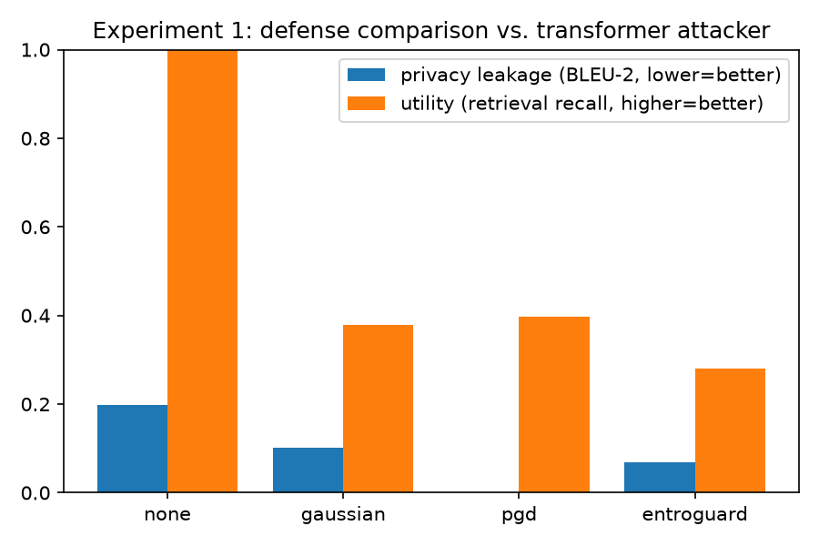
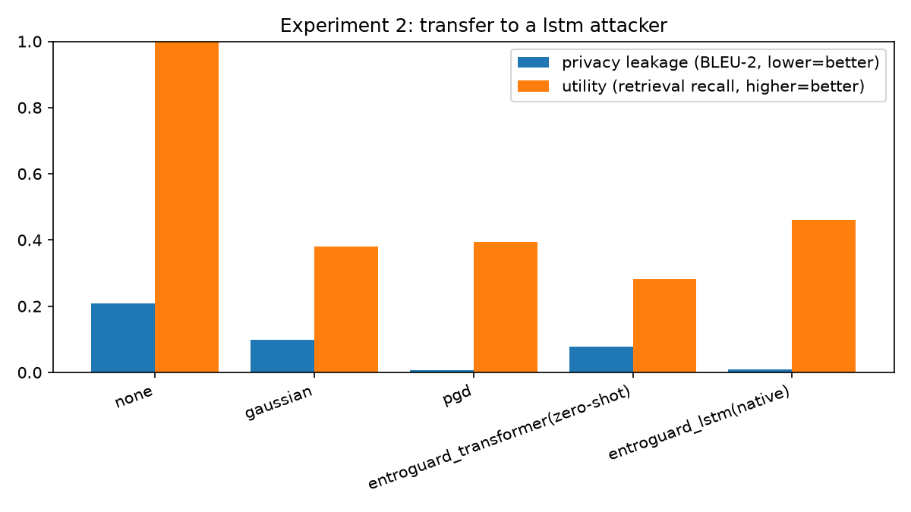
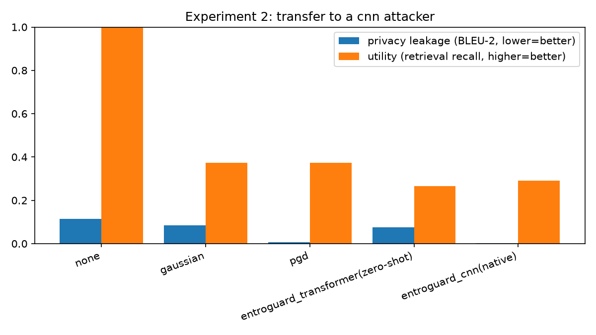

# EntroGuard: защита текстовых эмбеддингов от инверсии

Исследовательский практикум: реализация и эмпирическая проверка метода
**EntroGuard** — защиты эмбеддингов текста от **Embedding Inversion
Attack (EIA)** через максимизацию энтропии промежуточных представлений
атакующей модели, с последующим ограничением величины возмущения
(Bound-aware Perturbation Adaptation). Три эксперимента: (1)
воспроизведение метода и сравнение с базовыми защитами, (2) перенос
защиты на два архитектурно других (нетрансформерных) атакующих —
LSTM и causal-CNN, (3) устойчивость к **адаптивному** атакующему,
дообученному специально против каждой защиты. Есть поддержка
мультисидовых прогонов (`run_multiseed.py` + `aggregate_results.py`)
для оценки mean ± std вместо точечных цифр с одного запуска.

> Точных библиографических данных исходной статьи в репозитории нет —
> перенесён метод (формулы и алгоритм), а не цитата конкретного PDF.
> Подробный лог разработки, включая найденный и исправленный баг
> обучения (mode collapse генератора), — в [NOTES.md](NOTES.md).

## Содержание

- [Обзор метода](#обзор-метода)
- [Данные](#данные)
- [Эксперименты](#эксперименты)
- [Результаты](#результаты)
- [Выводы](#выводы)
- [Ограничения](#ограничения)
- [Структура проекта](#структура-проекта)
- [Быстрый старт](#быстрый-старт)
- [Дальнейшие улучшения](#дальнейшие-улучшения)

## Обзор метода

Угроза: сервис получает от пользователя эмбеддинг `e0 = f(text)` вместо
самого текста (частый паттерн в retrieval/RAG), но эмбеддинг всё ещё
можно инвертировать обратно в исходный (потенциально приватный) текст
обученной атакующей моделью. EntroGuard защищает `e0`, не трогая сам
энкодер `f` (чёрный ящик, заморожен) и не требуя переобучения
downstream-сервиса — только генератор возмущений `G_θ`, применяемый
поверх эмбеддинга перед отправкой.



**Обучение `G_θ`** (`entroguard.py`, `train_entroguard.py`) — против
ЗАМОРОЖЕННОГО, предварительно обученного атакующего:

```
loss(θ) = α·(1 − cos(e0, e')) − β·H(attacker(e')) − γ·CE(attacker(e'), text)
```

где `H` — средняя энтропия word-распределений на промежуточных
блоках/слоях атакующего (logit-lens, eq. 8) — чем выше, тем менее
уверенно (и, предположительно, менее точно) атакующий восстанавливает
текст. `α·L_sim` (eq. 9) удерживает возмущение близким к `e0` по
косинусу. Обучается только `G_θ`; атакующий — фиксированный
дифференцируемый критик.

Поскольку `L_sim` инвариантна к масштабу `e'`, сырой выход генератора
явно перенормируется к `‖e0‖` (`rescale_to_e0_norm`) ещё до вычисления
лоссов — иначе оптимизатор находит вырожденное решение (взрыв нормы
выхода), обесценивающее сравнение с бейзлайнами. Отдельно, уже на
инференсе, `bound_aware_adaptation` (Algorithm 1) гарантированно
проецирует итоговое возмущение в `epsilon`-шар по косинусному
расстоянию вокруг `e0` — жёсткое ограничение поверх мягкого лосса.

**Базовые защиты для сравнения** (`entroguard.py`):

| Защита | Тип | Требует доступ к атакующему |
|---|---|---|
| `none` | без защиты | — |
| `gaussian` | изотропный шум + проекция в epsilon-шар | нет (black-box) |
| `pgd` | градиентный подъём по loss атакующего, проекция на каждом шаге | да, white-box, `n_steps` итераций на запрос |
| `entroguard` | один forward через заранее обученный `G_θ` | да на этапе обучения `G_θ`; на инференсе — нет |

## Данные

| Корпус | Роль | HF dataset |
|---|---|---|
| PersonaChat | приватность / инверсия — короткие персона-фразы ("i work as a nurse") на train/val/test | `AlekseyKorshuk/persona-chat` |
| MS MARCO | полезность / retrieval — queries защищаются, passages образуют базу для `retrieval_recall_overlap`; **не участвует** в обучении атакующего или `G_θ` | `microsoft/ms_marco` (v1.1) |

Общий `Vocab` строится из объединения обоих корпусов (иначе слова
MS MARCO стали бы почти сплошным `<unk>` в общем encoder'е), ограничен
`config.VOCAB_MAX_SIZE` по частоте. Есть офлайн-фолбэк
(`config.DATA_SOURCE = "synthetic"`) на детерминированном шаблонном
корпусе — без сети, для быстрой проверки пайплайна. Подробности,
включая объяснение bookkeeping длин последовательностей, — в
[NOTES.md](NOTES.md#данные).

## Эксперименты

1. **Эксперимент 1** (`evaluate_defense.py`) — `none` / `gaussian` /
   `pgd` / `entroguard` против **transformer**-атакующего, один и тот же
   бюджет возмущения `epsilon`, три оси сравнения: приватность (BLEU-2 /
   ROUGE-1 / EMR, ниже = лучше), полезность (retrieval recall@5, выше =
   лучше), скорость (мс на 1000 запросов, ниже = лучше).
2. **Эксперимент 2** (`evaluate_transfer.py`) — перенос на **два**
   независимых нетрансформерных атакующих — **LSTM** (рекуррентность) и
   **causal-CNN** (дилатированные свёртки, TCN/WaveNet-стиль); ни один
   архитектурно не связан с transformer'ом, на котором считается
   entropy-сигнал eq. 8. Для каждой из целевых архитектур: та же
   четвёрка бейзлайнов плюс `entroguard`, обученный двумя способами —
   - *zero-shot*: переиспользуется генератор, обученный против
     transformer'а, без дообучения;
   - *native*: генератор обучен заново, но по тому же рецепту, прямо
     против целевого атакующего (не путать с "адаптивным атакующим"
     ниже — здесь адаптируется ЗАЩИТА, а не атакующий).
3. **Эксперимент 3** (`train_adaptive_attacker.py` + `evaluate_adaptive.py`)
   — устойчивость к **адаптивному атакующему**: вместо статического
   атакующего (обучен один раз на чистых эмбеддингах, никогда не видел
   защиту) берём attacker, дообученный именно против конкретной защиты
   (gaussian / pgd / entroguard) — то есть максимально информированный
   противник. Разница между static и adaptive BLEU-2/ROUGE-1 —
   "запас прочности" защиты (см. Carlini et al. об оценке adversarial
   robustness: статического атакующего для проверки защиты недостаточно).

Все три эксперимента можно прогнать по нескольким сидам сразу —
`run_multiseed.py` (обучает всё заново под каждый сид) +
`aggregate_results.py` (считает mean ± std и пишет `*_metrics_agg.json`),
вместо точечной оценки с одного случайного сида.

## Результаты

Один запуск, `SEED=1024`, `personachat`, полный бюджет по всем шагам
(дефолты `config.py`: 40 эпох attacker/entroguard, 20 эпох дообучения
адаптивного атакующего, `epsilon=0.15`, `α=6, β=1, γ=1`) — GPU (RTX 5060
Ti). Графики и таблицы генерируются заново каждым прогоном
(`results/`, не в git) — здесь зафиксирован снимок этого прогона в
`docs/`.

### Эксперимент 1 — против transformer-атакующего

| defense | BLEU-2 ↓ | ROUGE-1 ↓ | recall@5 ↑ | мс/1000 |
|---|---|---|---|---|
| none | 0.197 | 0.500 | 1.000 | ~0 |
| gaussian | 0.101 | 0.429 | 0.379 | 6.57 |
| pgd | **0.001** | 0.241 | **0.397** | 3.97 |
| entroguard | 0.069 | 0.433 | 0.281 | **2.19** |



Здесь `entroguard` уже заметно лучше `gaussian` по приватности (BLEU-2
0.069 против 0.101), при почти одинаковом ROUGE-1 (0.433 vs 0.429) — но
всё ещё проигрывает по полезности (recall 0.281 vs 0.379). От `pgd` по
приватности по-прежнему далеко, хотя разрыв в скорости на GPU не так
драматичен, как выглядел на CPU (см. примечание про `ms_per_1k_queries`
ниже).

### Эксперимент 2 — перенос на LSTM и CNN атакующих

| defense (vs LSTM) | BLEU-2 ↓ | ROUGE-1 ↓ | recall@5 ↑ | мс/1000 |
|---|---|---|---|---|
| none | 0.208 | 0.518 | 1.000 | ~0 |
| gaussian | 0.098 | 0.408 | 0.379 | 6.49 |
| pgd | 0.007 | 0.272 | 0.393 | 4.82 |
| entroguard *(zero-shot)* | 0.079 | 0.419 | 0.281 | 1.85 |
| entroguard *(native)* | **0.009** | **0.207** | **0.460** | 3.36 |



| defense (vs CNN) | BLEU-2 ↓ | ROUGE-1 ↓ | recall@5 ↑ | мс/1000 |
|---|---|---|---|---|
| none | 0.114 | 0.446 | 1.000 | ~0 |
| gaussian | 0.085 | 0.410 | 0.372 | 6.59 |
| pgd | 0.006 | 0.224 | 0.374 | 5.14 |
| entroguard *(zero-shot)* | 0.076 | 0.416 | 0.266 | 1.88 |
| entroguard *(native)* | **0.002** | **0.156** | 0.290 | 2.77 |



- **Zero-shot ≈ gaussian на обеих архитектурах**: веса, обученные против
  transformer'а, не переносятся ни на LSTM, ни на CNN — практически
  никакого выигрыша над случайным шумом. Перенос конкретных весов не
  работает, это подтверждается независимо дважды.
- **Native на LSTM — лучший сбалансированный результат проекта**:
  приватность почти как у `pgd` (даже ниже по ROUGE-1), да ещё и лучшая
  полезность из всех методов (recall 0.460, выше даже чем у `gaussian`
  и `pgd`).
- **Native на CNN — самая агрессивная защита из всех**: BLEU-2 (0.002) и
  ROUGE-1 (0.156) ниже, чем у `pgd` — то есть на CNN native-entroguard
  громит приватность сильнее white-box PGD-атаки. Цена — полезность
  худшая среди всех методов (recall 0.290). Значит, "рецепт"
  максимизации энтропии на разных архитектурах может попадать в разные
  точки компромисса приватность/полезность — баланс LSTM не гарантирован.

**О колонке скорости.** На GPU порядок неожиданно меняется: `pgd`
(10 шагов градиентного подъёма) оказывается *быстрее* `gaussian` (один
шаг + проекция). Причина — не в алгоритмах, а в реализации: и
`gaussian`, и `entroguard` всегда проходят через `bound_aware_adaptation`
(Algorithm 1), а её функция написана как **поэлементный Python-цикл**
с `.item()` на каждой итерации — на GPU это означает синхронизацию
CPU↔GPU на каждый вызов, что на порядки дороже, чем сама арифметика.
`pgd_defense` реже попадает в этот дорогой цикл коррекции при
`epsilon=0.15`, поэтому выигрывает. Итог: цифры в `ms_per_1k_queries`
сейчас показывают качество *этой конкретной реализации* Algorithm 1 на
GPU, а не чистую алгоритмическую стоимость защит — см.
[Дальнейшие улучшения](#дальнейшие-улучшения).

### Эксперимент 3 — адаптивный атакующий (transformer, полный бюджет 20 эпох)

| defense | static BLEU-2 | adaptive BLEU-2 | Δ BLEU-2 | static ROUGE-1 | adaptive ROUGE-1 | Δ ROUGE-1 |
|---|---|---|---|---|---|---|
| gaussian | 0.091 | 0.131 | +0.040 | 0.419 | 0.442 | +0.023 |
| pgd | 0.001 | 0.031 | +0.031 | 0.241 | 0.344 | +0.103 |
| entroguard | 0.069 | **0.208** | **+0.139** | 0.433 | 0.510 | +0.077 |

На полном бюджете (не на урезанном 5-эпоховом пробнике, как в
предыдущей ревизии) паттерн не просто подтвердился — усилился:
**`entroguard` теряет от адаптивного атакующего больше всех** (+0.139
BLEU-2 против +0.040 у `gaussian` и +0.031 у `pgd`). Более того,
*adaptive* BLEU-2 у `entroguard` (0.208) оказывается выше (то есть
хуже), чем даже *adaptive* BLEU-2 у `gaussian` (0.131) — при том что на
статическом атакующем `entroguard` выглядел заметно приватнее `gaussian`
(0.069 vs 0.091). Ранжирование защит буквально переворачивается в
зависимости от того, знает ли атакующий о защите заранее.

## Выводы

*Методология* максимизации энтропии (eq. 8) обобщается за пределы
transformer'а — но по-разному на разных архитектурах. На LSTM *native*
даёт лучший сбалансированный результат проекта: near-PGD приватность и
при этом лучшую полезность из всех методов. На CNN *native* заходит в
другую точку компромисса — приватность даже выше, чем у `pgd` (белого
ящика!), но ценой худшей полезности среди всех защит. В обоих случаях
конкретные *веса* одного обученного генератора на чужую архитектуру не
переносятся (zero-shot ≈ шум) — переносится именно рецепт обучения, не
артефакт. На своей "родной" архитектуре (Эксп. 1, transformer) метод
обгоняет `gaussian` по приватности (BLEU-2 0.069 vs 0.101), но не по
полезности — умеренный, а не однозначный положительный результат.

Эксперимент 3 на полном бюджете дал самый важный и неприятный для
`entroguard` вывод проекта: он теряет от адаптивного атакующего
**больше всех** (+0.139 BLEU-2 против +0.031-0.040 у `pgd`/`gaussian`),
причём настолько, что его *adaptive*-приватность становится хуже, чем
*adaptive*-приватность у примитивного `gaussian`. Ранжирование защит,
построенное на статическом атакующем (как в Эксп. 1/2 и в исходной
статье), в данном случае вводит в заблуждение относительно порядка
защит против информированного противника — ровно то, о чём предупреждает
литература по adversarial robustness (см. Carlini et al.), и здесь это
подтверждается на собственных данных, а не только цитатой.

## Ограничения

- Один сид (`SEED=1024`) — `run_multiseed.py`/`aggregate_results.py`
  умеют считать mean ± std по нескольким, но таблицы в этом README
  всё ещё точечные оценки с одного прогона (перегенерировать после
  `run_multiseed.py` — см. [Дальнейшие улучшения](#дальнейшие-улучшения)).
- Компактные модели (~100k-1.4M параметров) и небольшие подвыборки
  PersonaChat/MS MARCO — воспроизводимость и скорость важнее попытки
  побить SOTA.
- `EMR` (точное совпадение фразы) у всех методов ≈ 0, включая `none` —
  метрика слишком строгая для этого масштаба, ориентир — BLEU-2/ROUGE-1.
- Колонка `ms_per_1k_queries` на GPU отражает не алгоритмическую
  стоимость защит, а поведение конкретной (не векторизованной)
  реализации `bound_aware_adaptation` — см. примечание в разделе
  "Результаты" и пункт ниже.
- Эксперимент 3 (адаптивный атакующий) реализован только для
  transformer-атакующего; распространить на LSTM/CNN — небольшое
  изменение (`train_adaptive_attacker.py` уже принимает `--arch`), но
  комбинаций 3 архитектуры × 3 защиты пока никто не считал.
- PGD-адаптация атакующего использует градиенты самого дообучаемого
  атакующего (self-play) — по духу похоже на adversarial training, но
  не полноценная minimax-игра с чередованием шагов защитника/атакующего.

## Структура проекта

Полная таблица со всеми файлами и их ролью — в
[NOTES.md](NOTES.md#структура-проекта). Кратко:

```
data.py, models.py, entroguard.py, metrics.py     — метод и данные (модели: Transformer/LSTM/CNN-атакующие)
config.py, utils.py                                — гиперпараметры (+ ENTRO_* env), seed-tagging имён файлов
train_attacker.py, train_entroguard.py             — обучение (пишут results/history_*_seed<N>.json)
train_adaptive_attacker.py, evaluate_adaptive.py    — Эксперимент 3 (адаптивный атакующий)
evaluate_defense.py, evaluate_transfer.py           — Эксперимент 1 / 2 (2 — по всем нетрансформерным архитектурам)
run_multiseed.py, aggregate_results.py              — прогон по нескольким сидам + mean ± std
app.py                                              — веб-панель (запуск + живые логи + результаты)
make_report.py, viz_svg.py                          — статический HTML-отчёт без сервера
download_data.py, run_all.py                        — скачать данные / прогнать всё (1 сид) по CLI
Dockerfile, docker-compose.yml                      — контейнер с CUDA
```

## Быстрый старт

```bash
uv sync              # или: pip install -e .
python app.py         # http://localhost:8000 — панель запуска + результаты
```

Через Docker (нужен NVIDIA Container Toolkit для `--gpus`):

```bash
docker compose up --build
```

Без интерфейса, из терминала — по шагам или всё сразу
(`python run_all.py`); полная последовательность команд, объяснение
`ENTRO_*` переменных окружения для переопределения гиперпараметров и
разбор возможных ошибок — в [NOTES.md](NOTES.md#порядок-запуска).

## Дальнейшие улучшения

- Прогнать `run_multiseed.py` на нескольких сидах (инфраструктура и
  `aggregate_results.py` готовы, реального мультисидового прогона на
  железе ещё не было) и обновить таблицы этого README цифрами mean ± std.
- Векторизовать `bound_aware_adaptation` (Algorithm 1) — сейчас
  поэлементный Python-цикл с `.item()` на итерацию, из-за чего колонка
  скорости на GPU меряет накладные расходы синхронизации CPU↔GPU, а не
  алгоритмическую стоимость защит (см. "Результаты" и "Ограничения").
- Эксперимент 3 (адаптивный атакующий) для LSTM/CNN, не только
  transformer — полная матрица 3 архитектуры × 3 защиты; учитывая, что
  ранжирование защит на transformer'е перевернулось под адаптивной
  атакой, стоит проверить, повторяется ли это на других архитектурах.
- Ablation по `α/β/γ` и `epsilon` — сейчас взята одна точка на кривой
  приватность/полезность/бюджет.
- Вынести общую логику `evaluate_defense.py`/`evaluate_transfer.py` в
  один параметризуемый скрипт (сейчас частично дублируется).
- Полноценная minimax-игра для PGD-адаптации (чередование шагов
  атакующего и защитника), а не однократное дообучение против
  замороженного снапшота.
