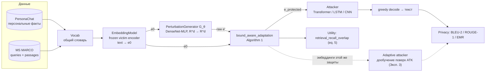
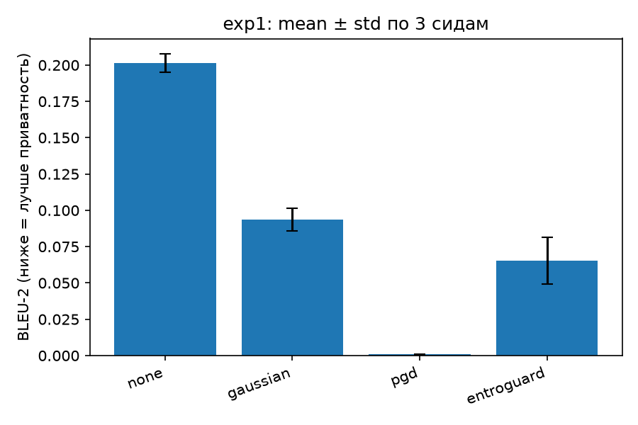
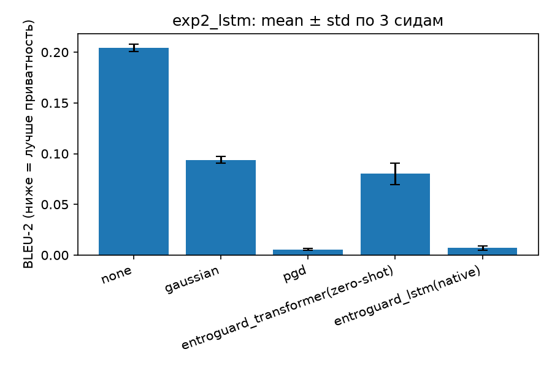
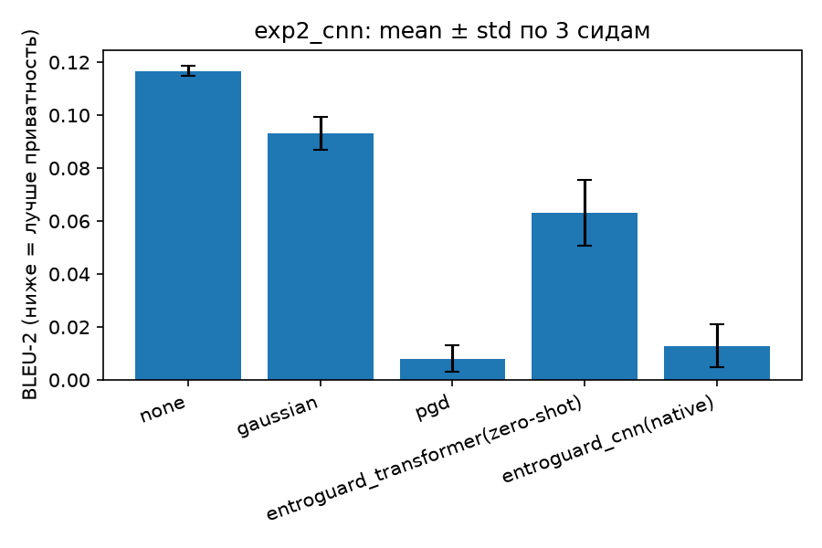

# EntroGuard: защита текстовых эмбеддингов от инверсии

Исследовательский практикум: реализация и эмпирическая проверка метода
**EntroGuard** — защиты эмбеддингов текста от **Embedding Inversion
Attack (EIA)** через максимизацию энтропии промежуточных представлений
атакующей модели, с последующим ограничением величины возмущения
(Bound-aware Perturbation Adaptation). Три эксперимента: (1)
воспроизведение метода и сравнение с базовыми защитами, (2) перенос
защиты на два архитектурно других (нетрансформерных) атакующих —
LSTM и causal-CNN, (3) устойчивость к **адаптивному** атакующему,
дообученному специально против каждой защиты. Есть поддержка
мультисидовых прогонов (`run_multiseed.py` + `aggregate_results.py`)
для оценки mean ± std вместо точечных цифр с одного запуска.

> Точных библиографических данных исходной статьи в репозитории нет —
> перенесён метод (формулы и алгоритм), а не цитата конкретного PDF.
> Подробный лог разработки, включая найденный и исправленный баг
> обучения (mode collapse генератора), — в [NOTES.md](NOTES.md).

## Содержание

- [Обзор метода](#обзор-метода)
- [Данные](#данные)
- [Эксперименты](#эксперименты)
- [Результаты](#результаты)
- [Выводы](#выводы)
- [Ограничения](#ограничения)
- [Структура проекта](#структура-проекта)
- [Демо](#демо)
- [Быстрый старт](#быстрый-старт)
- [Дальнейшие улучшения](#дальнейшие-улучшения)

## Обзор метода

Угроза: сервис получает от пользователя эмбеддинг `e0 = f(text)` вместо
самого текста (частый паттерн в retrieval/RAG), но эмбеддинг всё ещё
можно инвертировать обратно в исходный (потенциально приватный) текст
обученной атакующей моделью. EntroGuard защищает `e0`, не трогая сам
энкодер `f` (чёрный ящик, заморожен) и не требуя переобучения
downstream-сервиса — только генератор возмущений `G_θ`, применяемый
поверх эмбеддинга перед отправкой.


```mermaid
flowchart LR
    subgraph D["Данные"]
        PC[("PersonaChat<br/>персональные факты")]
        MM[("MS MARCO<br/>queries + passages")]
    end

    PC --> V["Vocab<br/>общий словарь"]
    MM --> V
    V --> EM["EmbeddingModel<br/>frozen victim encoder<br/>text → e0"]

    EM -- e0 --> G["PerturbationGenerator G_θ<br/>DenseNet-MLP, R^d → R^d"]
    G -- "raw e'" --> BA["bound_aware_adaptation<br/>Algorithm 1"]
    EM -- e0 --> BA
    BA -- e_protected --> ATK["Attacker<br/>Transformer / LSTM / CNN"]

    ATK --> DEC[greedy decode → текст]
    DEC --> PM["Privacy: BLEU-2 / ROUGE-1 / EMR"]
    BA --> RET["Utility: retrieval_recall_overlap (eq. 5)"]

    BA -.->|"эмбеддинги этой же защиты"| ADAPT["Adaptive attacker<br/>дообучение поверх ATK (Эксп. 3)"]
    ADAPT -.-> PM
```

**Обучение `G_θ`** (`entroguard.py`, `train_entroguard.py`) — против
ЗАМОРОЖЕННОГО, предварительно обученного атакующего:

```
loss(θ) = α·(1 − cos(e0, e')) − β·H(attacker(e')) − γ·CE(attacker(e'), text)
```

где `H` — средняя энтропия word-распределений на промежуточных
блоках/слоях атакующего (logit-lens, eq. 8) — чем выше, тем менее
уверенно (и, предположительно, менее точно) атакующий восстанавливает
текст. `α·L_sim` (eq. 9) удерживает возмущение близким к `e0` по
косинусу. Обучается только `G_θ`; атакующий — фиксированный
дифференцируемый критик.

Поскольку `L_sim` инвариантна к масштабу `e'`, сырой выход генератора
явно перенормируется к `‖e0‖` (`rescale_to_e0_norm`) ещё до вычисления
лоссов — иначе оптимизатор находит вырожденное решение (взрыв нормы
выхода), обесценивающее сравнение с бейзлайнами. Отдельно, уже на
инференсе, `bound_aware_adaptation` (Algorithm 1) гарантированно
проецирует итоговое возмущение в `epsilon`-шар по косинусному
расстоянию вокруг `e0` — жёсткое ограничение поверх мягкого лосса.

**Базовые защиты для сравнения** (`entroguard.py`):

| Защита | Тип | Требует доступ к атакующему |
|---|---|---|
| `none` | без защиты | — |
| `gaussian` | изотропный шум + проекция в epsilon-шар | нет (black-box) |
| `pgd` | градиентный подъём по loss атакующего, проекция на каждом шаге | да, white-box, `n_steps` итераций на запрос |
| `entroguard` | один forward через заранее обученный `G_θ` | да на этапе обучения `G_θ`; на инференсе — нет |

## Данные

| Корпус | Роль | HF dataset |
|---|---|---|
| PersonaChat | приватность / инверсия — короткие персона-фразы ("i work as a nurse") на train/val/test | `AlekseyKorshuk/persona-chat` |
| MS MARCO | полезность / retrieval — queries защищаются, passages образуют базу для `retrieval_recall_overlap`; **не участвует** в обучении атакующего или `G_θ` | `microsoft/ms_marco` (v1.1) |

Общий `Vocab` строится из объединения обоих корпусов (иначе слова
MS MARCO стали бы почти сплошным `<unk>` в общем encoder'е), ограничен
`config.VOCAB_MAX_SIZE` по частоте. Есть офлайн-фолбэк
(`config.DATA_SOURCE = "synthetic"`) на детерминированном шаблонном
корпусе — без сети, для быстрой проверки пайплайна. Подробности,
включая объяснение bookkeeping длин последовательностей, — в
[NOTES.md](NOTES.md#данные).

## Эксперименты

1. **Эксперимент 1** (`evaluate_defense.py`) — `none` / `gaussian` /
   `pgd` / `entroguard` против **transformer**-атакующего, один и тот же
   бюджет возмущения `epsilon`, три оси сравнения: приватность (BLEU-2 /
   ROUGE-1 / EMR, ниже = лучше), полезность (retrieval recall@5, выше =
   лучше), скорость (мс на 1000 запросов, ниже = лучше).
2. **Эксперимент 2** (`evaluate_transfer.py`) — перенос на **два**
   независимых нетрансформерных атакующих — **LSTM** (рекуррентность) и
   **causal-CNN** (дилатированные свёртки, TCN/WaveNet-стиль); ни один
   архитектурно не связан с transformer'ом, на котором считается
   entropy-сигнал eq. 8. Для каждой из целевых архитектур: та же
   четвёрка бейзлайнов плюс `entroguard`, обученный двумя способами —
   - *zero-shot*: переиспользуется генератор, обученный против
     transformer'а, без дообучения;
   - *native*: генератор обучен заново, но по тому же рецепту, прямо
     против целевого атакующего (не путать с "адаптивным атакующим"
     ниже — здесь адаптируется ЗАЩИТА, а не атакующий).
3. **Эксперимент 3** (`train_adaptive_attacker.py` + `evaluate_adaptive.py`)
   — устойчивость к **адаптивному атакующему**: вместо статического
   атакующего (обучен один раз на чистых эмбеддингах, никогда не видел
   защиту) берём attacker, дообученный именно против конкретной защиты
   (gaussian / pgd / entroguard) — то есть максимально информированный
   противник. Разница между static и adaptive BLEU-2/ROUGE-1 —
   "запас прочности" защиты (см. Carlini et al. об оценке adversarial
   robustness: статического атакующего для проверки защиты недостаточно).

Все три эксперимента можно прогнать по нескольким сидам сразу —
`run_multiseed.py` (обучает всё заново под каждый сид) +
`aggregate_results.py` (считает mean ± std и пишет `*_metrics_agg.json`),
вместо точечной оценки с одного случайного сида.

## Результаты

Мультисидовый прогон, **n=3 сида** (1024, 42, 7), `personachat`, полный
бюджет по всем шагам (дефолты `config.py`: 40 эпох attacker/entroguard,
20 эпох дообучения адаптивного атакующего, `epsilon=0.15`, `α=6, β=1,
γ=1`) — GPU (RTX 5060 Ti), через `run_multiseed.py` +
`aggregate_results.py`. Каждый сид — независимое переобучение всех
моделей заново (не три инференса одной модели), поэтому std ниже
отражает и вариативность обучения тоже. Ниже — mean ± std по трём
сидам; агрегированные JSON/MD и графики с error bar'ами — в `results/`
(не в git), снимок графиков — в `docs/`.

### Эксперимент 1 — против transformer-атакующего

| defense | BLEU-2 ↓ | ROUGE-1 ↓ | recall@5 ↑ | мс/1000 |
|---|---|---|---|---|
| none | 0.2014 ± 0.0064 | 0.5049 ± 0.0054 | 1.0000 ± 0.0000 | ~0 |
| gaussian | 0.0935 ± 0.0079 | 0.4246 ± 0.0057 | 0.3687 ± 0.0155 | 8.12 ± 0.50 |
| pgd | **0.0007 ± 0.0004** | 0.2514 ± 0.0163 | **0.3856 ± 0.0161** | 5.12 ± 0.26 |
| entroguard | 0.0652 ± 0.0161 | 0.4142 ± 0.0136 | 0.2485 ± 0.0494 | **2.57 ± 0.20** |



Здесь `entroguard` устойчиво лучше `gaussian` по приватности (BLEU-2
0.065 против 0.094, разброс между сидами не перекрывается) при близком
ROUGE-1 (0.414 vs 0.425) — но всё ещё проигрывает по полезности (recall
0.249 vs 0.369). От `pgd` по приватности по-прежнему далеко. У
`entroguard` заметно наибольший разброс по recall@5 (±0.049 против
±0.016 у остальных) — защита менее стабильна между сидами именно по
полезности.

### Эксперимент 2 — перенос на LSTM и CNN атакующих

| defense (vs LSTM) | BLEU-2 ↓ | ROUGE-1 ↓ | recall@5 ↑ | мс/1000 |
|---|---|---|---|---|
| none | 0.2043 ± 0.0037 | 0.5033 ± 0.0110 | 1.0000 ± 0.0000 | ~0 |
| gaussian | 0.0938 ± 0.0032 | 0.4019 ± 0.0107 | 0.3687 ± 0.0155 | 8.18 ± 0.58 |
| pgd | 0.0057 ± 0.0010 | 0.2585 ± 0.0133 | 0.4041 ± 0.0125 | 6.32 ± 0.46 |
| entroguard *(zero-shot)* | 0.0802 ± 0.0105 | 0.3987 ± 0.0196 | 0.2485 ± 0.0494 | 2.73 ± 0.28 |
| entroguard *(native)* | **0.0071 ± 0.0021** | **0.2261 ± 0.0150** | **0.3889 ± 0.0399** | 4.20 ± 0.18 |



| defense (vs CNN) | BLEU-2 ↓ | ROUGE-1 ↓ | recall@5 ↑ | мс/1000 |
|---|---|---|---|---|
| none | 0.1167 ± 0.0020 | 0.4389 ± 0.0092 | 1.0000 ± 0.0000 | ~0 |
| gaussian | 0.0931 ± 0.0062 | 0.4062 ± 0.0025 | 0.3735 ± 0.0008 | 8.16 ± 0.61 |
| pgd | 0.0080 ± 0.0049 | 0.2322 ± 0.0058 | 0.3764 ± 0.0110 | 6.73 ± 0.26 |
| entroguard *(zero-shot)* | 0.0631 ± 0.0124 | 0.3860 ± 0.0262 | 0.2449 ± 0.0456 | 2.65 ± 0.20 |
| entroguard *(native)* | **0.0129 ± 0.0080** | **0.1977 ± 0.0472** | 0.3240 ± 0.0886 | 4.09 ± 0.64 |



- **Zero-shot ≈ gaussian на обеих архитектурах**: веса, обученные против
  transformer'а, не переносятся ни на LSTM, ни на CNN — практически
  никакого выигрыша над случайным шумом. Перенос конкретных весов не
  работает, это подтверждается независимо дважды и устойчиво по трём
  сидам.
- **Native на LSTM — лучший сбалансированный результат проекта**:
  приватность почти как у `pgd` (даже ниже по ROUGE-1), да ещё и лучшая
  полезность из всех методов (recall 0.389, на уровне `pgd` и выше
  `gaussian`) — но и разброс по recall самый большой на LSTM (±0.040).
- **Native на CNN — самая агрессивная защита из всех, но и самая
  нестабильная**: BLEU-2 (0.013) и ROUGE-1 (0.198) в среднем ниже, чем у
  `pgd`, однако разброс между сидами (±0.008 BLEU-2, ±0.047 ROUGE-1,
  ±0.089 recall) на порядок больше, чем у любой другой защиты на CNN —
  "рецепт" максимизации энтропии на CNN даёт сильную, но существенно
  менее воспроизводимую защиту, чем на LSTM или transformer'е.

**О колонке скорости.** На GPU порядок неожиданно меняется: `pgd`
(10 шагов градиентного подъёма) оказывается *быстрее* `gaussian` (один
шаг + проекция). Причина — не в алгоритмах, а в реализации: и
`gaussian`, и `entroguard` всегда проходят через `bound_aware_adaptation`
(Algorithm 1), а её функция написана как **поэлементный Python-цикл**
с `.item()` на каждой итерации — на GPU это означает синхронизацию
CPU↔GPU на каждый вызов, что на порядки дороже, чем сама арифметика.
`pgd_defense` реже попадает в этот дорогой цикл коррекции при
`epsilon=0.15`, поэтому выигрывает. Итог: цифры в `ms_per_1k_queries`
сейчас показывают качество *этой конкретной реализации* Algorithm 1 на
GPU, а не чистую алгоритмическую стоимость защит — см.
[Дальнейшие улучшения](#дальнейшие-улучшения).

### Эксперимент 3 — адаптивный атакующий (transformer, полный бюджет 20 эпох)

| defense | static BLEU-2 | adaptive BLEU-2 | Δ BLEU-2 | static ROUGE-1 | adaptive ROUGE-1 | Δ ROUGE-1 |
|---|---|---|---|---|---|---|
| gaussian | 0.0932 ± 0.0182 | 0.1341 ± 0.0151 | 0.0409 ± 0.0033 | 0.4229 ± 0.0089 | 0.4442 ± 0.0106 | 0.0212 ± 0.0026 |
| pgd | 0.0007 ± 0.0004 | 0.0312 ± 0.0008 | 0.0305 ± 0.0005 | 0.2514 ± 0.0163 | 0.3564 ± 0.0120 | 0.1050 ± 0.0064 |
| entroguard | 0.0652 ± 0.0161 | **0.2037 ± 0.0030** | **0.1385 ± 0.0164** | 0.4142 ± 0.0136 | 0.5060 ± 0.0044 | 0.0918 ± 0.0119 |

На мультисидовом прогоне (n=3) паттерн не просто подтвердился — оказался
самым устойчивым результатом всего проекта: **`entroguard` теряет от
адаптивного атакующего больше всех** (Δ BLEU-2 = 0.1385 ± 0.0164 против
0.0409 ± 0.0033 у `gaussian` и 0.0305 ± 0.0005 у `pgd`) — интервалы
±std между `entroguard` и остальными двумя защитами не перекрываются ни
разу. При этом *adaptive* BLEU-2 у `entroguard` (0.204, std всего
±0.003 — самый низкий разброс среди всех защит в этой таблице)
устойчиво выше (то есть хуже), чем *adaptive* BLEU-2 у `gaussian`
(0.134) — при том что на статическом атакующем `entroguard` выглядел
заметно приватнее `gaussian` (0.065 vs 0.093). Ранжирование защит
буквально переворачивается в зависимости от того, знает ли атакующий о
защите заранее, и это не артефакт одного сида.

## Выводы

Мультисидовый прогон (n=3) подтверждает: *методология* максимизации
энтропии (eq. 8) обобщается за пределы transformer'а — но по-разному на
разных архитектурах, и с разной стабильностью. На LSTM *native* даёт
лучший сбалансированный результат проекта: near-PGD приватность и при
этом лучшую полезность из всех методов, с умеренным разбросом между
сидами. На CNN *native* заходит в другую точку компромисса —
приватность даже выше, чем у `pgd` (белого ящика!), но ценой худшей
полезности среди всех защит и заметно большего разброса по всем
метрикам — на CNN защита сильнее, но менее воспроизводима от сида к
сиду. В обоих случаях конкретные *веса* одного обученного генератора на
чужую архитектуру не переносятся (zero-shot ≈ шум) — переносится именно
рецепт обучения, не артефакт, и это подтверждается независимо на трёх
сидах. На своей "родной" архитектуре (Эксп. 1, transformer) метод
обгоняет `gaussian` по приватности (BLEU-2 0.065 vs 0.094, интервалы
±std не перекрываются), но не по полезности — умеренный, а не
однозначный положительный результат.

Эксперимент 3 дал самый важный и неприятный для `entroguard` вывод
проекта, и он же оказался самым статистически устойчивым: на всех трёх
сидах `entroguard` теряет от адаптивного атакующего **больше всех**
(Δ BLEU-2 = 0.139 ± 0.016 против 0.031–0.041 у `pgd`/`gaussian`,
интервалы не перекрываются), причём настолько, что его
*adaptive*-приватность становится хуже, чем *adaptive*-приватность у
примитивного `gaussian`. Ранжирование защит, построенное на статическом
атакующем (как в Эксп. 1/2 и в исходной статье), в данном случае вводит
в заблуждение относительно порядка защит против информированного
противника — ровно то, о чём предупреждает литература по adversarial
robustness (см. Carlini et al.), и здесь это подтверждается на
собственных данных по трём независимым сидам, а не на одном прогоне.

## Ограничения

- Мультисидовый прогон сделан на n=3 (1024, 42, 7) — статистически
  достаточно, чтобы увидеть неперекрывающиеся интервалы там, где эффект
  большой (Эксп. 3, transformer-Эксп. 1), но недостаточно для строгих
  доверительных интервалов; больше сидов сузили бы std, особенно для CNN
  *(native)*, где разброс сейчас самый большой в проекте.
- Компактные модели (~100k-1.4M параметров) и небольшие подвыборки
  PersonaChat/MS MARCO — воспроизводимость и скорость важнее попытки
  побить SOTA.
- `EMR` (точное совпадение фразы) у всех методов ≈ 0, включая `none` —
  метрика слишком строгая для этого масштаба, ориентир — BLEU-2/ROUGE-1.
- Колонка `ms_per_1k_queries` на GPU отражает не алгоритмическую
  стоимость защит, а поведение конкретной (не векторизованной)
  реализации `bound_aware_adaptation` — см. примечание в разделе
  "Результаты" и пункт ниже.
- Эксперимент 3 (адаптивный атакующий) реализован только для
  transformer-атакующего; распространить на LSTM/CNN — небольшое
  изменение (`train_adaptive_attacker.py` уже принимает `--arch`), но
  комбинаций 3 архитектуры × 3 защиты пока никто не считал.
- PGD-адаптация атакующего использует градиенты самого дообучаемого
  атакующего (self-play) — по духу похоже на adversarial training, но
  не полноценная minimax-игра с чередованием шагов защитника/атакующего.

## Структура проекта

Полная таблица со всеми файлами и их ролью — в
[NOTES.md](NOTES.md#структура-проекта). Кратко:

```
data.py, models.py, entroguard.py, metrics.py     — метод и данные (модели: Transformer/LSTM/CNN-атакующие)
config.py, utils.py                                — гиперпараметры (+ ENTRO_* env), seed-tagging имён файлов
train_attacker.py, train_entroguard.py             — обучение (пишут results/history_*_seed<N>.json)
train_adaptive_attacker.py, evaluate_adaptive.py    — Эксперимент 3 (адаптивный атакующий)
evaluate_defense.py, evaluate_transfer.py           — Эксперимент 1 / 2 (2 — по всем нетрансформерным архитектурам)
run_multiseed.py, aggregate_results.py              — прогон по нескольким сидам + mean ± std
app.py                                              — веб-панель: Пайплайн (запуск + живые логи) / Результаты / Демо
demo.py                                             — логика вкладки «Демо» (атака/защита на реальных чекпоинтах)
make_report.py, viz_svg.py                          — статический HTML-отчёт без сервера
download_data.py, run_all.py                        — скачать данные / прогнать всё (1 сид) по CLI
Dockerfile, docker-compose.yml                      — контейнер с CUDA
```

### Демо

Вкладка **«Демо»** в `app.py` — интерактивная песочница поверх реально
обученных чекпоинтов (тех же, что и в Эксперименте 1): вводите фразу,
атакующий (transformer) сначала показывает, что он восстанавливает из
незащищённого эмбеддинга, затем — из эмбеддинга после выбранной защиты
(`gaussian` / `pgd` / `entroguard`), плюс BLEU-2 к оригиналу для обеих
реконструкций и cosine-сходство защищённого эмбеддинга с исходным (мера
сохранённой полезности). Модели грузятся лениво по сиду и кешируются в
памяти процесса; для работы демо нужны хотя бы
`attacker_transformer_seed<N>.pt` и `entroguard_transformer_seed<N>.pt`
для одного сида (обучаются шагами 1a/2a на вкладке «Пайплайн»). Слова
вне словаря подсвечиваются отдельно — модель обучена на ограниченном
словаре PersonaChat/MS MARCO, а не на открытом английском.

Есть и галочка **«сравнить с адаптивным атакующим»** (Эксперимент 3, если
для выбранных сида/защиты обучен `attacker_transformer_adaptive_<defense>_seed<N>.pt`):
третьей карточкой демо декодирует ТОТ ЖЕ защищённый эмбеддинг атакующим,
дообученным именно против этой защиты, и показывает Δ BLEU-2 к
статическому результату. На примере `"i work as a teacher"` (сид 1024)
это видно особенно наглядно: против статического атакующего entroguard
давит утечку до BLEU-2 0.000 (как и pgd) — но стоит подставить адаптивного
атакующего, и entroguard откатывается к BLEU-2 0.775, ровно на уровень
утечки без всякой защиты, тогда как gaussian и pgd на той же фразе
остаются на 0.000 против обоих атакующих — то же расхождение, что и в
таблице Эксперимента 3, но на одном конкретном предложении.

## Быстрый старт

```bash
uv sync              # или: pip install -e .
python app.py         # http://localhost:8000 — панель запуска + результаты
```

Через Docker (нужен NVIDIA Container Toolkit для `--gpus`):

```bash
docker compose up --build
```

Без интерфейса, из терминала — по шагам или всё сразу
(`python run_all.py`); полная последовательность команд, объяснение
`ENTRO_*` переменных окружения для переопределения гиперпараметров и
разбор возможных ошибок — в [NOTES.md](NOTES.md#порядок-запуска).

## Дальнейшие улучшения

- Расширить мультисидовый прогон с n=3 до n≥5 (`run_multiseed.py` +
  `aggregate_results.py` уже отработали на 3 сидах) — особенно важно для
  CNN *(native)*, где сейчас самый большой разброс между сидами в
  проекте.
- Векторизовать `bound_aware_adaptation` (Algorithm 1) — сейчас
  поэлементный Python-цикл с `.item()` на итерацию, из-за чего колонка
  скорости на GPU меряет накладные расходы синхронизации CPU↔GPU, а не
  алгоритмическую стоимость защит (см. "Результаты" и "Ограничения").
- Эксперимент 3 (адаптивный атакующий) для LSTM/CNN, не только
  transformer — полная матрица 3 архитектуры × 3 защиты; учитывая, что
  ранжирование защит на transformer'е перевернулось под адаптивной
  атакой, стоит проверить, повторяется ли это на других архитектурах.
- Ablation по `α/β/γ` и `epsilon` — сейчас взята одна точка на кривой
  приватность/полезность/бюджет.
- Вынести общую логику `evaluate_defense.py`/`evaluate_transfer.py` в
  один параметризуемый скрипт (сейчас частично дублируется).
- Полноценная minimax-игра для PGD-адаптации (чередование шагов
  атакующего и защитника), а не однократное дообучение против
  замороженного снапшота.
